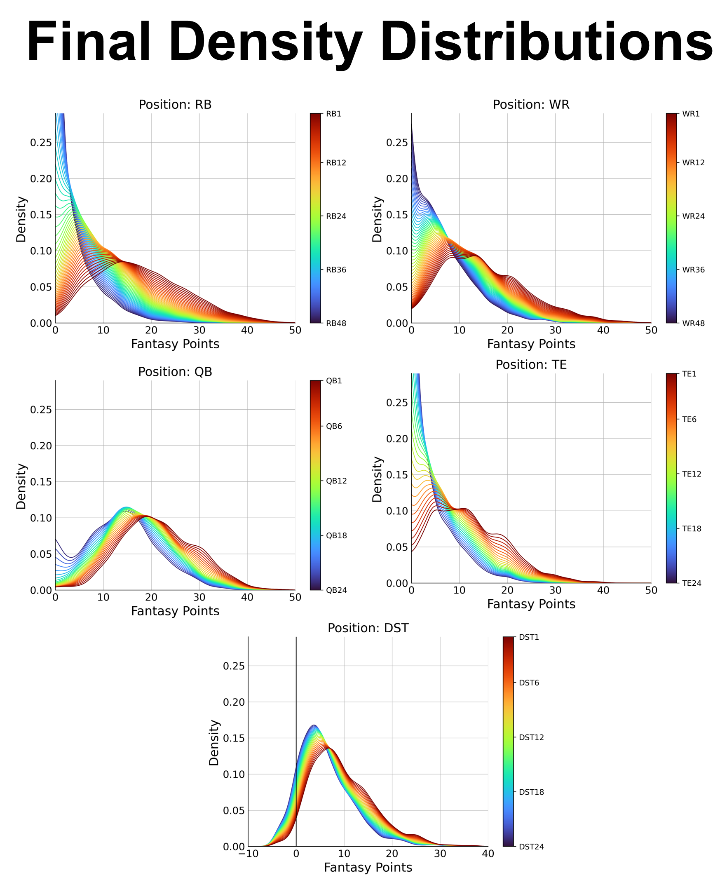
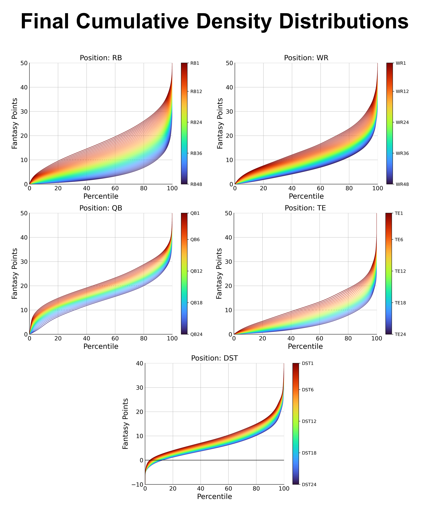

# Projecting non-parametric NFL player performances from ordinal data

## Abstract

In the past twenty years, statisticians and their models have revolutionized 
professional baseball and basketball at all levels of team operations. 
However, effectively modeling players’ performances in the National Football 
League (NFL) remains elusive due to three common pitfalls in modeling NFL data: 
(1) football games contain many variables, (2) datasets are small, and (3) 
patterns are non-parametric. I developed a supervised learning approach, 
which seeks to overcome these challenges. My method translates publicly 
available expert rankings into probability distributions, predicting each 
player’s likely performance in the upcoming week. The distributions are fit 
using kernel density estimation, followed by a series of processing steps to 
eliminate overfitting and noise. 

The present repo contains the code used for this Python project. Full details on
the project are provided in this 
[white paper](https://drive.google.com/file/d/1ml9dRE8Aqx3htos0nMnKif_fHV3WQo2P/view?usp=share_link). 
This README illustrates the primary results (the distributions) and later gives a summary of this repo's code.

## Results

The figure just below provides the final distributions for each position.

Notice that the distributions are oftentimes not smooth, with slight humps and 
plateaus. These humps and plateaus are not noise, as increasing the horizontal 
smoothing to eliminate them lowers model fit on testing data. 
These patterns arise due to touchdowns (worth 6 points) being a discrete factor 
influencing fantasy points. For example, see the wide receiver (WR) plot in the 
top right. There is first a plateau from 8-13 points and then a lower plateau 
from 17-21 points. Wide receiver performances at the lower plateau were likely 
linked to one more touchdown than those from the earlier one. 

This second figure provides the cumulative distributions for each position.

## Code organization
### Scraping & Organizing data

The files in directory `scrape_prepare_input` scrape historic expert ranking data from the website, FantasyPros.
They retrieve expert ranks for every player across every week of every NFL season from 2013-2021.
These files also organize the data.
I prepared documentation for the most pivotal pieces of code, including: 
* `organize.organize_input.py`
* `scrape.scrape_fantasypros.py`

### Creating the distributions
Based on the scraped data, the files in directory `make_distributions` create probability distributions, 
predicting player performance based on their expert ranking. These are described in detail in the white paper. 
I prepared documentation for the most pivotal pieces of code, including: 
* `setup_expert_distributions.py`
* `density.py`
* `concat_ranks.py`
* `smooth.py`
* `test_accuracy.py`
* `plot.py`

## General pipeline

`setup_expert_distributions.py` runs the pipeline, it calls all the functions below.

Creating a distribution involves first scraping historic ranking and scoring data 
using `scrape.scrape_fantasypros.py`. The scraped data are then organized into 
Pandas dataframes using `scrape.organize_input.py`.

After the data are loaded, the dataframes data are further organized into numpy arrays. 
Then, functions from `density.py` are called to create the density distributions.
In creating the distributions, `density.py` calls functions from `concat_ranks.py` 
to carry out the concatenation procedures described in the white paper. 
After this, the distributions are smoothed using functions from `smooth.py`. 
Next, the accuracy of the distributions is tested using cross-validation and 
functions from `test_accuracy.py`. Testing accuracy is used to tune the  
hyperparameters described in the white paper. Finally, the distributions are
plotted using functions from `plot.py`.